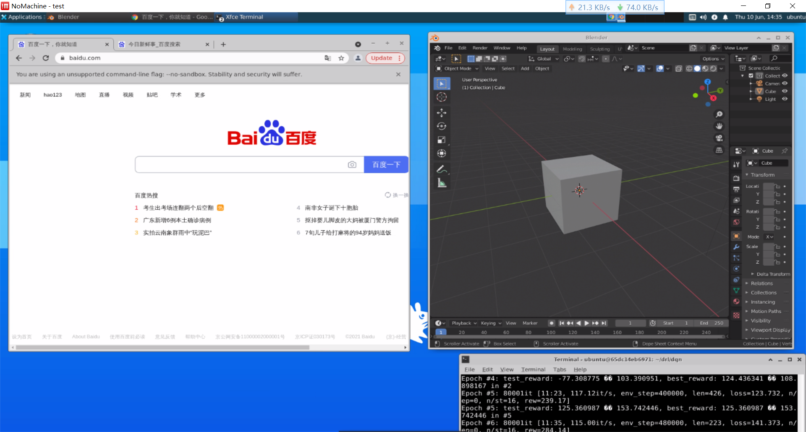

# Ubuntu Desktop based on Docker

[](https://hub.docker.com/r/gezp/ubuntu-desktop) 

## 1.简介
该项目提供了一个docker镜像，可以将虚拟桌面系统（xfce4桌面）运行于ubuntu headless主机上的docker容器中，并且可以使用ssh或远程桌面访问，你几乎可以把容器当作虚拟机使用。

> 注意，如果需要使用GPU硬件加速的OpenGL渲染，这里的宿主机需要安装Ubuntu Desktop系统（自带桌面系统，不支持宿主机为Ubuntu Server系统），可使用`HDMI欺骗器`代替显示器。
> 可以运行在云服务器（如阿里云，腾讯云等）上，但是不支持GPU 3D加速。

ubuntu-desktop Docker镜像特性：

* 支持ssh远程访问，支持xfce4远程桌面访问。
* 支持软件模拟的OpenGL渲染，可运行3D渲染软件 (如gazebo, blender)。
* 支持GPU硬件加速的OpenGL渲染（需要Nvidia GPU支持，宿主机必须是桌面系统）
* 自带Chrome浏览器。
* 自带CUDA, 支持深度学习训练 (如pytorch, tensorflow)。

> 它可以当作ubuntu虚拟开发环境使用，适合教研室公共主机共享使用。相比虚拟机，容器是轻量级的（虽然把容器当作虚拟使用不符合容器的哲学：一个容器运行一个APP），其优点如下：
>
> * 启动快（秒级别）。
> * 通过隔离功能，开启多个容器，满足不同开发环境需求（避免不同软件包版本冲突）。
> * 容器之间可以方便进行共享（文件共享，网络共享）
> * 迁移方便（导出镜像，可在不同主机上迁移环境）。
> * 支持远程桌面与ssh，几乎满足大部分开发需求。

xfce4（远程）桌面示意图



>实现原理:
>
> 采用`nvidia/opengl`为基础镜像 + xfce4桌面软件 + nomachine远程桌面软件（支持VirtualGL），从而实现3D GUI程序运行，替换基础镜像为`nvidia/cudagl`，从而实现支持cuda的能力。

镜像TAG:

支持的镜像TAG对应[Github Tag](https://github.com/gezp/docker-ubuntu-desktop/tags)，具有两类：
* 基本镜像(基于`nvidia/opengl`基础镜像)的TAG：`18.04`, `20.04`
* 支持CUDA的镜像(基于`nvidia/cudagl`基础镜像)的TAG：`18.04-cu10.1`, `20.04-cu11.0`, `20.04-cu11.2.0`等, 命名规则为`{UBUNTU VERSION}-cu{CUDA VERSION}`, 其中cuda的版本号支持列表见[Docker Image <nvidia/cudagl>](https://gitlab.com/nvidia/container-images/cudagl/-/blob/DOCS/supported-tags.md)

>目前支持CUDA版本号：
> * Ubuntu18.04支持的CUDA版本号：`10.1`, `10.2`, `11.0`, `11.1`, `11.2.0`, `11.3.0`, `11.4.0`
> * Ubuntu20.04支持的CUDA版本号：`11.0`, `11.1`, `11.2.0`, `11.3.0`, `11.4.0`

## 2.基本使用

### 2.1 准备工作

* 安装nvidia驱动
* 安装docker和nvidia-container-runtime.

> 注意nvidia版本驱动，过老的版本驱动不支持新版本的cuda容器.

### 2.2 快速使用

docker pull: 拉取镜像
```bash
docker pull gezp/ubuntu-desktop:20.04-cu11.0
# 国内用户可使用阿里云仓库
# docker pull registry.cn-hongkong.aliyuncs.com/gezp/ubuntu-desktop:20.04-cu11.0
```

docker run: 创建并运行容器
```bash
# 宿主机需要运行xhost允许所有用户访问X11服务（运行一次即可）,宿主机环境变量$DISPLAY必须为0
xhost +
# 支持ssh和 3D GUI
docker run -d --restart=on-failure \
    --name my_workspace \
    --cap-add=SYS_PTRACE \
    --gpus all  \
    --shm-size=1024m \
    -v /tmp/.X11-unix:/tmp/.X11-unix:rw \
    -p 10022:22  \
    -p 14000:4000  \
    gezp/ubuntu-desktop:20.04-cu11.0
```
* 默认用户名和密码均为ubuntu

ssh连接容器
```bash
#ssh访问容器
ssh ubuntu@host-ip -p 10022
```

* 可使用vscode + remote ssh插件访问

远程桌面连接容器

* 下载nomachine软件，ip为主机ip，端口为14000，进行连接即可

## 3.扩展使用

### 3.1 自定义用户参数

在创建容器时可使用环境变量自定义`USER`, `PASSWORD`, `GID`, `UID`配置，例如：
```bash
docker run -d --restart=on-failure \
    --name my_workspace \
    --cap-add=SYS_PTRACE \
    --gpus all  \
    -e USER=cat \
    -e PASSWORD=cat123 \
    -e GID=1001 \
    -e UID=1001 \
    --shm-size=1024m \
    -v /tmp/.X11-unix:/tmp/.X11-unix:rw \
    -p 10022:22  \
    -p 14000:4000  \
    gezp/ubuntu-desktop:20.04-cu11.0
```

### 3.2 3D硬件渲染加速

测试VirtualGL

```bash
vglrun glxinfo | grep -i "opengl"
```

* 显示包含NVIDIA GPU型号，则表示正确

> host主机上的DISPLAY必须为`:0` .

运行3D软件时，需要加上`vglrun`命令前缀，如`vglrun gazebo`。

### 3.3 CUDA使用说明

需要在`.bashrc`文件中加入以下语句更新环境变量
```bash
export CUDA_HOME=/usr/local/cuda
export PATH=/usr/local/cuda/bin:$PATH
export LD_LIBRARY_PATH=/usr/local/cuda/lib64:$LD_LIBRARY_PATH
```
* 更多使用参考`nvidia/cuda`Docker镜像的说明。

## 4. 本地镜像构建

例如
```bash
git clone https://github.com/gezp/docker-ubuntu-desktop.git
cd docker-ubuntu-desktop
# for 20.04 (基于nvidia/opengl基础镜像)
./docker_build.sh 20.04
# for 20.04-cu11.0  (基于nvidia/cudagl基础镜像)
./docker_build.sh 20.04-cu11.0
```
